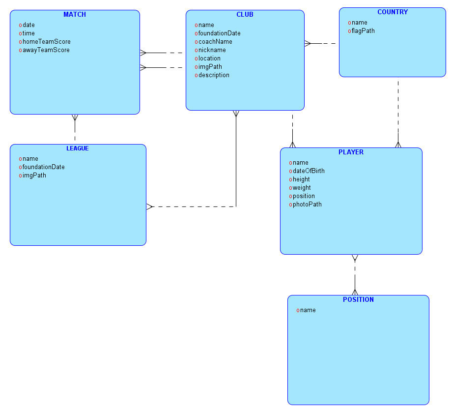

# Football Fixtures Backend

Tato aplikace slouží jako backend pro webovou aplikaci sloužící pro zobrazení fotbalových zápasů, podrobnější informace
o jednotlivých týmech, hráčích a ligách.

## Datový model databáze

## Rozdělení balíčků

* Backend část aplikace je rozdělená na několik balíčků: `controller`, `domain`, `dto`, `filters`, `repository`
  , `security`, `service` a `util`
* Tyto balíčky budou v této části stručně popsány

### Balíček `controller`

Obsahuje všechny controllery definující všechny endpointy, která aplikace zpřístupňuje. Mezi tyto controllery patří:

| název controlleru | význam                                                                           |
|-------------------|----------------------------------------------------------------------------------|
| ClubController    | definuje endpointy pracující se všemi kluby                                      |
| CountryController | definuje endpointy pracující se všemi zeměmi uloženými v databázi                |
| LeagueController  | definuje endpointy pracující s ligami                                            |
| MainController    | definuje endpoint na autentifikaci uživatele, pomocí uživatelského jména a hesla |
| MatchController   | definuje endpointy pracující se zápasy                                           |
| PlayerController  | definuje endpointy pro práci s hráči                                             |

### Balíček `domain`

Tento balíček definuje tabulky pomocí anotací Spring JPA. Tabulky obsažené v databázi jsou zobrazené v datovém modelu
výše.

### Balíček `dto`

Dto = data transfer object.
Jedná se o balíček, který obsahuje třídy, které slouží ke konverzi tříd obsažených v
balíčku `domain` na třídy, které slouží k přenosu dat mezi frontendem a backendem zejména kvůli bezpečnosti vstupů.
Tento balíček je rozdělen ještě na podbalíček `input`, který obsahuje vstupní datové objekty.

### Balíček `filters`

Obsahuje pouze jednu třídu, a to `JwtRequestFilter`, která se stará o získání jwt tokenu z hlavičky requestu.

### Balíček `repository`

Obsahuje interfacy, které obsahují metody pro komunikaci s databází a u třídy `MatchController` je také využito
stránkování a řazení, podle času zápasů.

### Balíček `security`

Obsahuje 2 třídy, první třída `CorsConfig` slouží pro nastavení Cross-Origin Resource Sharing, aby povolovala komunikaci
s localhostem a druhá třída `WebSecurityConfig` slouží pro nastavení endpointu pro autentifikaci, aby byl přístupný i
pro neautentifikovaného uživatele a pro všechny ostatní endpointy vyžaduje validní jwt token.

### Balíček `service`

Obsahuje veškerý obslužný kód a metody, které jsou nutné provést po provolání endpointu. Je zde taky definována
třída `ResourceNotFoundException` definuje výjimku, která se vyhodí, pokud nebyl požadovaný objekt nalezen

### Balíček `util`

Obsahuje pouze jednu třídu, a to `JwtUtil`, která pouze definuje JWT_SECRET a pomáhá generovat jwt token a extrahovat
uživatelské jméno z tohoto tokenu